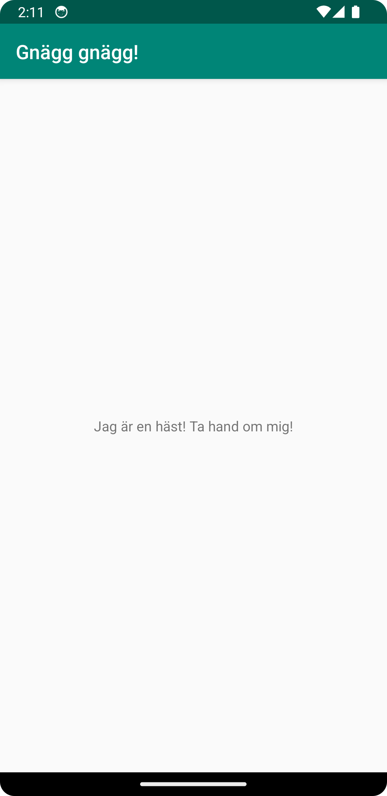

# Rapport

Det första jag gjorde var att ändra namnet på appen från "Hello" till "Gnägg gnägg!".
Detta gjorde jag genom att gå till strings.xml och skriva in "Gnägg gnägg!" på följande sätt:
<string name="app_name">Gnägg gnägg!</string>

För att ändra texten "Hello" i app innehållet så skapade jag en ny "String" i "string.xml":
`<string name="app_content">Jag är en häst! Ta hand om mig!</string>`

Denna länkade jag till i "activity_main.xml" genom att ersätta "app_name" med "app_content" på 
följande sätt:
`android:text="@string/app_content"`

